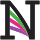

*************************
Nengo branding guidelines
*************************

The core of Nengo's visual identity
is the square logo for light backgrounds.

Logo origin
===========

Neuron tuning curves play a central role
in most models created with Nengo.
By knowing how a neuron responds
to some input signal,
we are able to construct large, dynamic models
that reproduce and predict
neuroscientific and psychological data.
The logo incorporates tuning curves
from four leaky integrate-and-fire neurons
in Nengo's initial letter.

The four tuning curves can be seen
in isolation with the following script.

.. code-block:: python

   import matplotlib.pyplot as plt
   import nengo
   from nengo.utils.ensemble import tuning_curves
   from nengo.utils.matplotlib import set_color_cycle

   with nengo.Network() as model:
       A = nengo.Ensemble(n_neurons=4, dimensions=1,
                          encoders=[[-1], [-1], [-1], [-1]],
                          intercepts=[-1, -1, -1, -1],
                          max_rates=[40, 65, 90, 120])
   with nengo.Simulator(model) as sim:
       eval_points, activities = tuning_curves(A, sim)

   plt.rc("lines", solid_capstyle="butt")
   set_color_cycle(["#984EA3", "#E7298A", "#4DAF4A", "#212121"])
   plt.figure(figsize=(6, 11))
   plt.plot(eval_points, activities, lw=40)
   plt.xlim(-1.1, 1.1)
   plt.axis("off")
   plt.show()

The font modified to incorporate the tuning curves
is `Sanchez <https://fonts.google.com/specimen/Sanchez>`_.
This font is also used for all text
in the :ref:`general logos <Assets for the Nengo ecosystem>`.

The design process from initial concepts
to a full finished product can be read
`on this Nengo forum thread
<https://forum.nengo.ai/t/help-choose-a-new-nengo-logo/199>`_.

Variations
==========

Each Nengo logo comes in three sizes.
The **full logo** should be used whenever possible.
Use the **square logo** in places like
profile pictures that require square sizes.
The **small square logo** should be used
when the logo will appear at small sizes
(50 pixels and lower),
such as for web page favicons.

Each logo size also contains
dark and light variations.
In all situations,
ensure that there is enough contrast
between the logo and the background.

If none of the logos available here
work for your particular use case,
please `file an issue <https://github.com/nengo/design/issues/new>`_.
*Do not make your own logo variant*
without first consulting with the Nengo team.

Misuses
=======

The available logo variants can been freely
resized to fit the situation.
However, most other image manipulations should be avoided.

Changing aspect ratio
  Do not scale any logo disproportionately.
  Maintain the aspect ratio of the original logo when resizing.
Rasterizing unnecessarily
  Do not convert logos to raster formats like PNG or JPEG
  unless necessary.
  All logos are provided as Scalable Vector Graphics (SVG) files
  that retain sharp lines at any size.
  If rasterization is necessary, use as high a DPI as possible.
Rotating or skewing
  Do not rotate or skew the logo.
Recoloring
  Do not recolor the logo.
  If you would like a different color variant than is currently provided,
  `file an issue explaining your use case
  <https://github.com/nengo/design/issues/new>`_.
Adding effects
  Do not apply any effects,
  such as outlining, beveling, or adding dropshadows,
  to logos.
Busy backgrounds
  Do not use the logo with a busy background.
  There should always be sufficient contrast
  so that all logo elements can be seen.
  If necessary, add a solid colored rectangle
  behind the logo.

Project branding
================

All Nengo projects have their own logo,
which is a variant of the main logo.
Project logos differ from the main logo
in that they include the full project name,
and all colors within the logo
are derived from the project's primary color.
However, many aspects are the same,
including the font,
and the shape of the N.

Colors
------

Every project chooses a unique primary color.
The unique part of the project name
(e.g., the "DL" in "NengoDL")
is colored with this primary color.

The top colored curve in the N
is also colored with this primary color
in most variants of the logo.
The other two curves
are lighter tints of the primary color.

To ensure that these logos have consistent tinting,
this repository includes a ``generate_colors.py`` script
that generates all the colors needed
for all logo variants based on the primary color.

For example, the primary color for NengoDL is #ff6600.
The rest of the colors for the curves in the N are:

.. code-block:: none

   $ python generate_colors.py ff6600
   #########  full_light  #########
   Top      #ff6600 (255, 102, 0)
   Middle   #ff8432 (255, 132, 50)
   Bottom   #ffa366 (255, 163, 102)

   ######### square_light #########
   Top      #ff6600 (255, 102, 0)
   Middle   #ff8432 (255, 132, 50)
   Bottom   #ffa366 (255, 163, 102)

   #########  full_dark   #########
   Top      #ff6600 (255, 102, 0)
   Middle   #cc5100 (204, 81, 0)
   Bottom   #993d00 (153, 61, 0)

   ######### square_dark  #########
   Top      #ffe0cc (255, 224, 204)
   Middle   #ffc199 (255, 193, 153)
   Bottom   #ffa366 (255, 163, 102)

Fonts
-----

Project logos use the same Sanchez font
as the general Nengo logo.
The size of the unique part of the project name
should match the size of the "Nengo" text.
Other aspects of the text,
such as the spacing between letters,
should also match the "Nengo" text
as best as possible.

Once the text looks natural,
it is converted from an SVG text object to a path,
which is done in Inkscape
by selecting the text
and clicking Path > Object to Path,
or by pressing Shift + Ctrl + C.
This allows the text to appear the same
in all situations,
including when the Sanchez font
is not available.

Files
-----

The main logo files are created in Inkscape.
If you are creating a set of logo files
for a new project,
it is generally easiest
to start from another project's files
and modify them to suit your project,
rather than starting from scratch.

However they are made,
all files should follow these guidelines,
in addition to those detailed
in the previous two sections:

1. All the paths making up the N
   should be contained in one SVG group.
2. All letters, including the group making up the N,
   should be contained in one SVG group.
3. There should be no extra objects in the SVG,
   even if they are outside of the normal viewport.
4. There should be no transparent elements in the SVG.
   These do not always render the same on all devices.
5. The SVG document should have small margins
   around the content. In Inkscape, this is done
   in the Document Properties window (Shift + Ctrl + D).
   Expand the "Resize page to content..." section
   and include the same small margin on all four sides.
6. Favicons should be 32x32 and created
   from the square-light logo.
